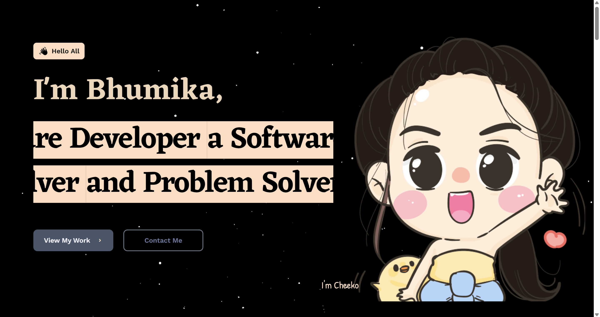
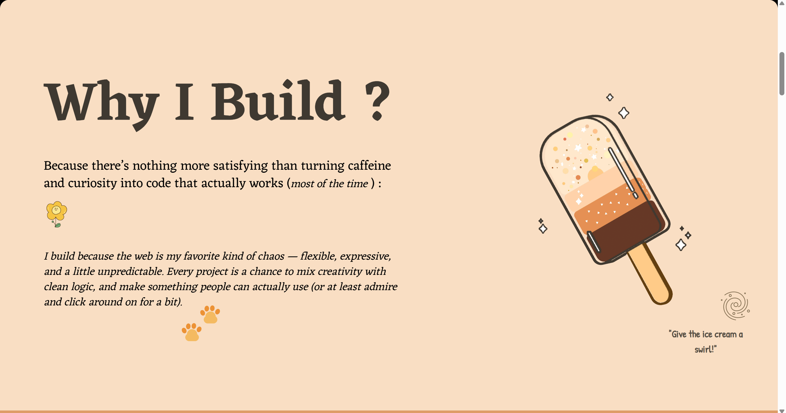
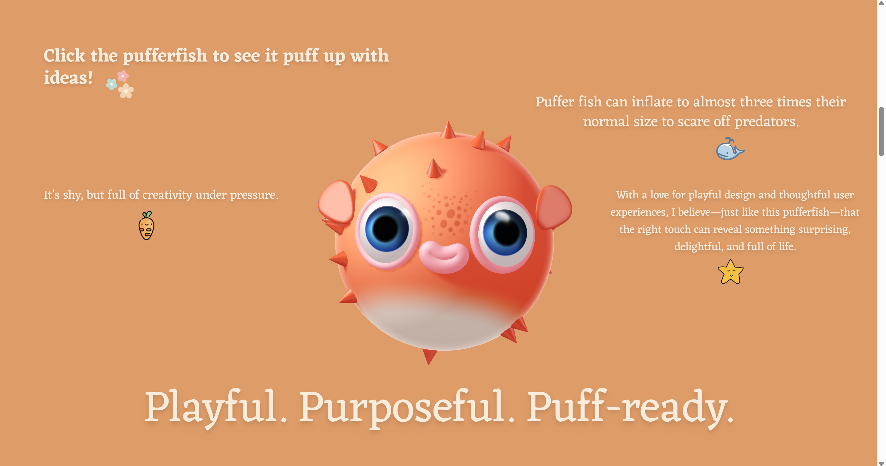
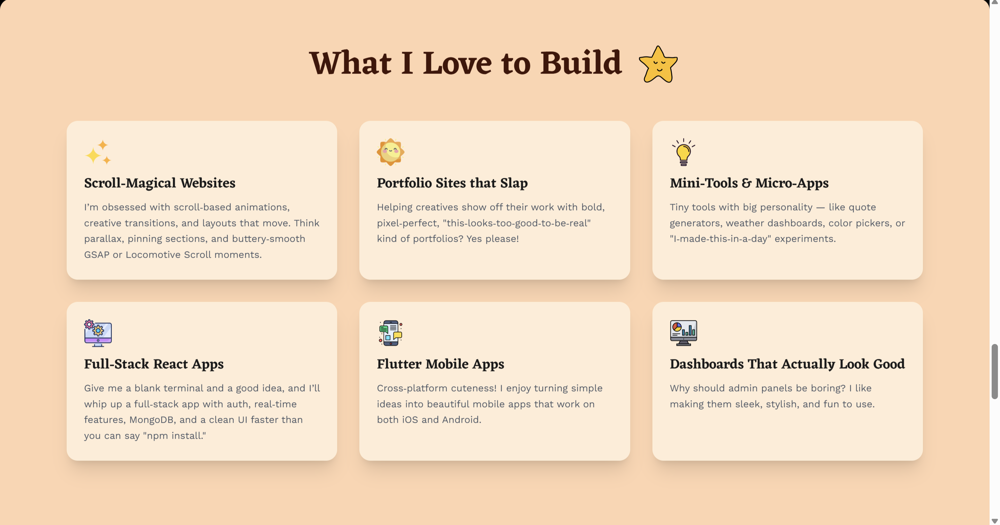
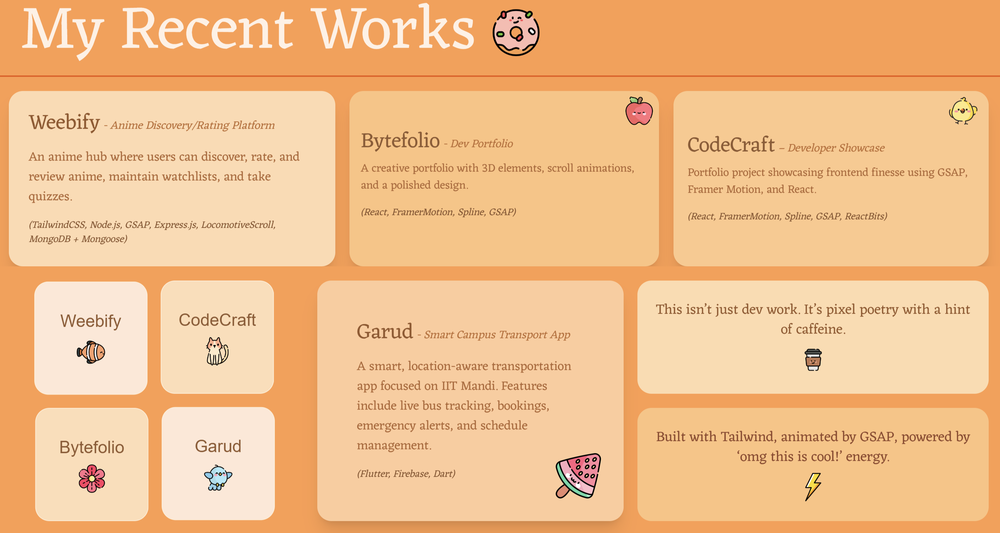
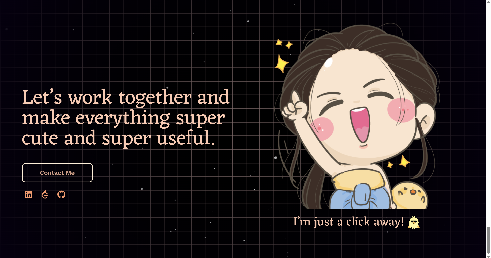

# 🧡🌐 Personal Portfolio Website

Welcome to my **personal portfolio website**, built with **React** and powered by a suite of cutting-edge frontend tools. This project represents my technical depth, visual creativity, and user-first design mindset.

---

## 🚀 Live Demo

🔗 <a href="https://code-craft-n2wl.vercel.app/" style="color: #FFA500;">Visit My Portfolio</a>

---

## ✨ Features

### 🧍‍♀️ About Me
A brief but impactful section introducing who I am, my tech journey, and what excites me about building things on the web.

### 🧠 Technical Skills
A categorized grid of tools, languages, and frameworks I’ve mastered — illustrated for clarity.

### 🧰 Projects
Each project features:
- 📝 Title and brief summary
- 🧪 Tech stack used
- 🔗 Source code / live demo
- 🎞️ Subtle animations on hover using GSAP and Framer Motion

### 🌐 Social Media Integration
Connect with me via:
- 🧡 <a href="https://github.com/BitByBit-101" style="color: #FFA500;">GitHub</a>
- 🧡 <a href="https://www.linkedin.com/in/bhumika-meena-a58843359" style="color: #FFA500;">LinkedIn</a>
- 🧡 <a href="https://leetcode.com/u/Flamingo289/" style="color: #FFA500;">LeetCode</a>

### 🎮 Animations & Effects
- ✨ **GSAP + Framer Motion** for rich animations
- 🧊 **Spline** 3D canvas models
- 🌀 **Locomotive Scroll** for buttery-smooth inertia scrolling

### 🧩 Component Architecture
Structured with **React Bits** to ensure reusable components and scalable code.

### 🎨 Tailwind Theming
A fully responsive layout with consistent styling using **Tailwind CSS** utilities and custom color palette (orange–white dominant).

---

## 📸 Demo Screenshots

<p align="center">
  
  
</p>
<p align="center">
  
  
</p>
<p align="center">
  
  
</p>

---

## 🎥 Demo Video

🔗 <a href="https://drive.google.com/uc?id=1CSPRl7vf43FabesN84d_BLHFKQLc7FrF&export=download" style="color: #FFA500;">Demo Video</a>

---

## 📇 Contact & Socials

- 🔗 <a href="https://github.com/BitByBit-101" style="color: #FFA500;">GitHub</a>
- 💼 <a href="https://www.linkedin.com/in/bhumika-meena-a58843359" style="color: #FFA500;">LinkedIn</a>
- 🧠 <a href="https://leetcode.com/u/Flamingo289/" style="color: #FFA500;">LeetCode</a>

---

## 📦 Installation

```bash
git clone https://github.com/BitByBit-101/CodeCraft.git
cd portfolio
npm install
npm start
```

---

## 🌍 Deployment

🟠 Hosted live using **Vercel**

---

## 🤝 Contributing

This is a personal showcase project. Suggestions and improvements are always welcome!

---

Thank you for visiting! 🧡
